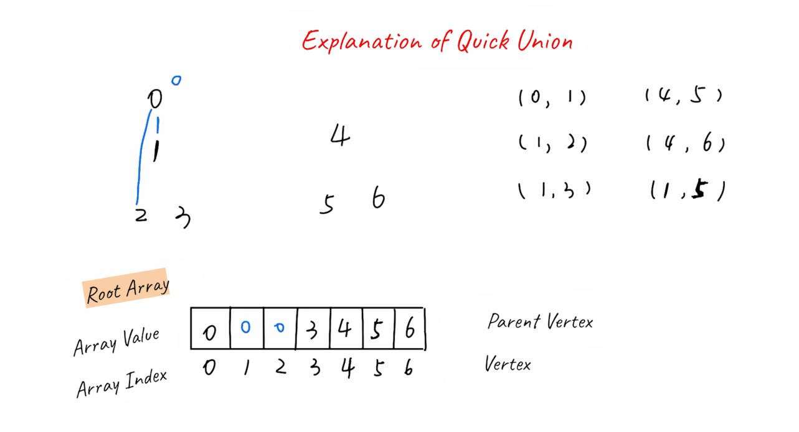
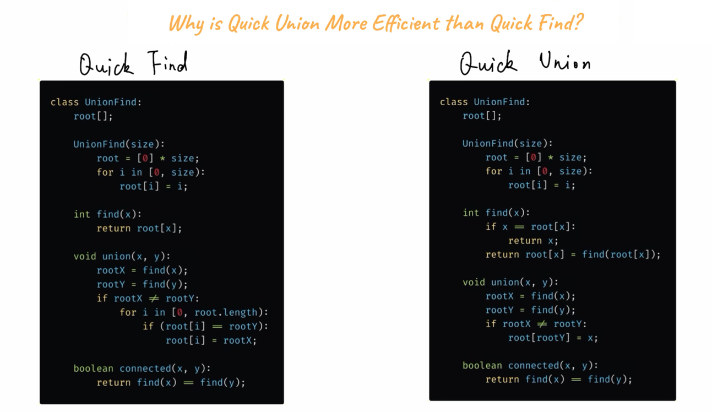

# Quick Union

In this the union operation is fast but the find operation is slow.

In quick union operation time complexity will be o(N). 
for find method it will be o(N) in worst case.

# Comparison

